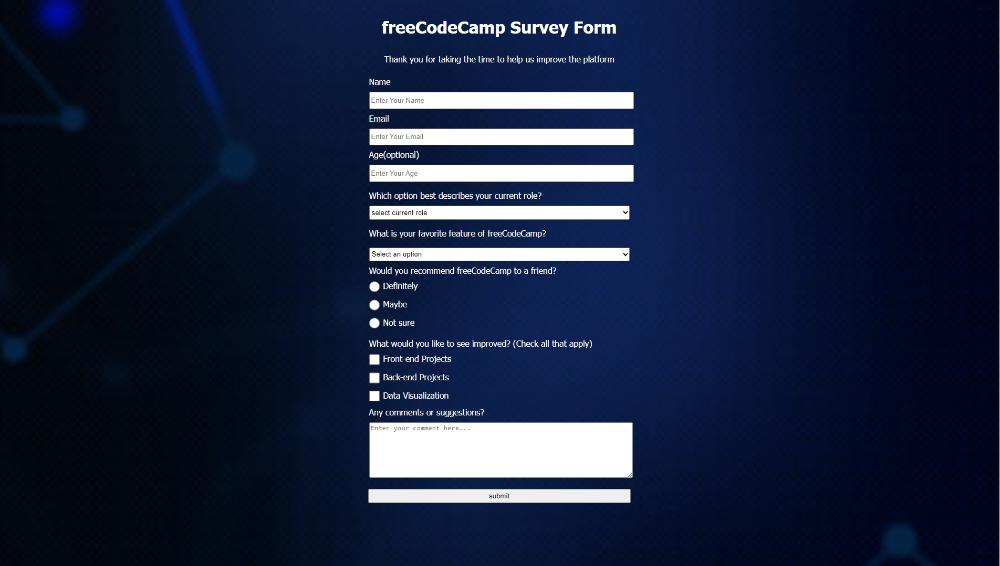

# Survey Form Project

This is a simple survey form project for freeCodeCamp. The form collects user data to help improve the platform. Users can provide their name, email, and optionally their age. They can also select their current role, favorite feature of freeCodeCamp, and whether they would recommend the platform to a friend. Additionally, users can check options they would like to see improved and provide any comments or suggestions.
## Preview

## Getting Started

To view the survey form, simply open the "index.html" file in your web browser.

## Built With

- HTML5
- CSS3

## Styling

The project uses "assinment1.css" for styling.

## Author

[Omar Saleh](https://github.com/MrMariodude)

## Acknowledgments

- This project was created as part of freeCodeCamp's curriculum.
